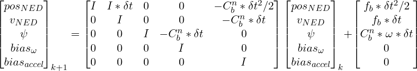

# GNSS/INS Kalman filter for Aerospace Applications
In this repo, two Kalman filters are presented. The first one is the 6-state INS Kalman Filter that is able to estimate 
the attitude (roll, and pitch) of an UAV using a 6-DOF IMU using accelerometer and gyro rates. The second one is 15-state GNSS/INS Kalman Filter, 
that extend the previous filter with the position, velocity, and heading estimation using a GNSS, IMU, and magnetometer.

## 1) INS Kalman filter
This 6-state filter estimate the attitude and gyroscope biases.
For the prediction step, the gyro rates are used to estimate the attitude angles. The angular rates are rotated 
to the inertial frame via the rotational matrix .
During the update or measurement step, the accelerometer is used to compute the declination in roll
and pitch. It is also possible to estimate the yaw angle with an additional sensor.
However, to keep it simple, this first filter does not estimate that angle.

### Prediction model

### Simulation script
ins_filter_full_state_demo.py

### Results

## 2) GNSS/INS Kalman filter
This 15-state filter estimate the position (NED), speed (NED), 
attitude, gyro biases, and accelerometer biases.
During the prediction step, similarly to the first filter, the angular rates in the NED frame 
are used to predict the attitude. The specific force fb is used to predict the position and velocity.
The specific force can be estimated from the accelerometer measurements. First, those values
are rotated to the NED frame using the  matrix. Then, the gravity is subtracted from the D coordinate. This is an approximation,
as the value of the gravity is assumed as a constant.

### Prediction model

### Simulation script
gnss_filter_full_state_demo.py

### Results
It can be noticed for the position and velocity (in orange), that the filter is doing a good job reducing the noise in the
measurements (blue).

### Notes
Normally, a GNSS sensor will output the position in ECEF or LLA coordinates.
For an UAV, it is more common to use NED coordinates, as they provide more manageable numbers in a cartesian frame.
In order to transform those coordinates to NED, a reference point (usually the take-off position) and a rotational matrix
are used. More info can be found in https://en.wikipedia.org/wiki/Local_tangent_plane_coordinates.
Also, if a magnetometer is used to measure the heading, a magnetic reference is needed to correct the magnetic field.
The world magnetic model (http://www.ngdc.noaa.gov/geomag/WMM/) provide those values based on the global position.
